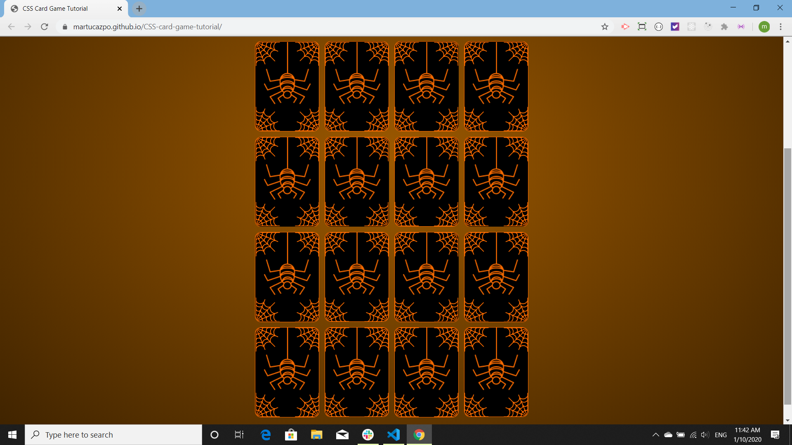

# CSS-card-game-tutorial

This CSS card game is a [tutorial](https://www.youtube.com/watch?v=28VfzEiJgy4&list=PLZlA0Gpn_vH8mpXIUHjWoMAAgoCEinL0R) from [Web Dev Simplified](https://www.youtube.com/channel/UCFbNIlppjAuEX4znoulh0Cw).  The [javascript portion of the tutorial](https://www.youtube.com/watch?v=3uuQ3g92oPQ) is from [portEXE](https://www.youtube.com/channel/UCjGQyJCSU_VVMTu5nigonqg) None of the code is mine -- I wish it were, because it's really cool.

The javascript is object oriented, consisting of two class constructors; one for the audio and the other for the game. The CSS is really good, it moves the images on the front and the back of the cards, as well as flipping the cards.

Here is a gif of the game being played:

Here are some static shots of the different screens, as well as a shot of the card backs:

My rendering of this tutorial is [published on GitHub](https://martucazpo.github.io/CSS-card-game-tutorial/). Click on the link and try the game out!